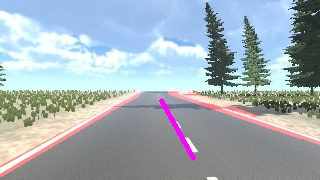
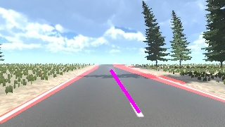
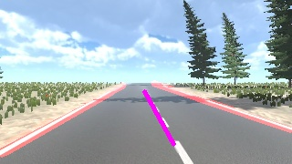
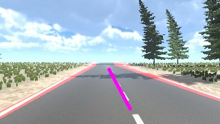
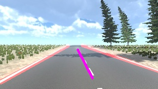
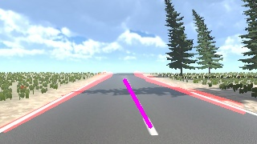
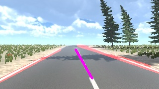
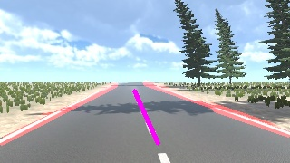
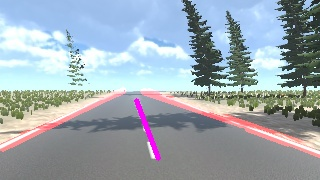

# Assignment 3 Report: Lane Detection using Edge Detection and Hough Transform

**Student Name:** `<Your Name>`  
**Student ID:** `<Your ID>`  
**Course:** Computer Vision  
**Assignment:** Assignment 3 - Lane Detection using Edge Detection and Hough Transform  
**GitHub Repository:** `https://github.com/<your-username>/<your-repo>`

## 1. Objective
The objective of this assignment is to implement a lane detection pipeline using:
- Canny Edge Detection
- Hough Transform line detection

The program should process all 10 road images using a single codebase and produce output images with detected lane markings.

## 2. Input and Output
- **Input:** 10 road-scene images captured from a front-facing driving viewpoint.
- **Output:** 10 corresponding images with lane lines overlaid on the original images.

Implementation file:
- `Week3_Detection/hough_transform_math_model.py`

Output folder:
- `Week3_Detection/Outputs/`

## 3. Method
The same processing pipeline is used for every input image:

1. Read input image.
2. Convert to grayscale.
3. Apply Gaussian blur to reduce noise.
4. Apply Canny edge detection.
5. Apply a polygon Region of Interest (ROI) mask to focus on the road area.
6. Apply Probabilistic Hough Transform (`cv2.HoughLinesP`) to detect line segments.
7. Filter detected segments by:
   - slope range
   - segment position (left/right road boundary constraints)
8. Draw filtered lane segments on the original image.
9. (Optional extension) Estimate lane center line by:
   - fitting left and right lane boundaries
   - sampling two horizontal scanlines
   - connecting the two midpoint locations

## 4. Parameter Tuning and Final Values
The final parameter set below was tuned and reused for all 10 images.

### 4.1 Preprocessing and Edge Detection
- Gaussian kernel: `(3, 3)`
- Canny low threshold: `95`
- Canny high threshold: `285`

### 4.2 Hough Transform
- `rho = 1.5`
- `theta = pi/180`
- `threshold = 55`
- `minLineLength = 28`
- `maxLineGap = 38`

### 4.3 Geometric Filtering
- Keep non-horizontal segments: `abs(dy) >= 10`
- Left-lane slope range: `[-5.0, -0.25]`
- Right-lane slope range: `[0.25, 0.60]`
- Additional x-position constraints are used to reject false positives from shadows and center dashes.

### 4.4 ROI Polygon (relative to image size)
- `(0, 1.00H)`
- `(0, 0.80H)`
- `(0.30W, 0.50H)`
- `(0.60W, 0.50H)`
- `(1.00W, 0.75H)`
- `(1.00W, 1.00H)`

## 5. Results (All 10 Output Images)

### Output 1


### Output 2


### Output 3


### Output 4


### Output 5


### Output 6


### Output 7


### Output 8


### Output 9


### Output 10


## 6. Challenges and How They Were Solved
### Challenge 1: False positives from shadows and texture
Road shadows and background textures produced many unwanted edges.

**Solution:**  
Used ROI masking plus slope and position-based segment filtering to keep only lane-like segments.

### Challenge 2: Parameter sensitivity across different frames
A parameter set that worked for one image could fail on another.

**Solution:**  
Tested multiple Canny and Hough settings, then selected one robust set that worked consistently across all 10 images.

### Challenge 3: Optional lane-center estimation stability
Simple midpoint estimation at one image row can be unstable.

**Solution:**  
Computed centerline from two scanline midpoints between fitted boundaries, giving a more stable center estimate.

## 7. Optional Extension
The optional lane-center extension was implemented by drawing a **center line** (magenta) between detected lane boundaries.  
This is based on midpoint geometry at two vertical positions and gives a clear lane-center visualization.

## 8. Conclusion
This assignment successfully implemented a single Python/OpenCV pipeline that processes all 10 images with one shared codebase.  
Using Canny edge detection, ROI masking, and Hough line detection with tuned parameters produced reliable lane visualization across the dataset.  
The optional lane-center extension was also implemented and visualized.

---

## 9. How to Run
From project root:

```bash
python3 Week3_Detection/hough_transform_math_model.py
```

Generated outputs will be saved in:
- `Week3_Detection/Outputs/`
